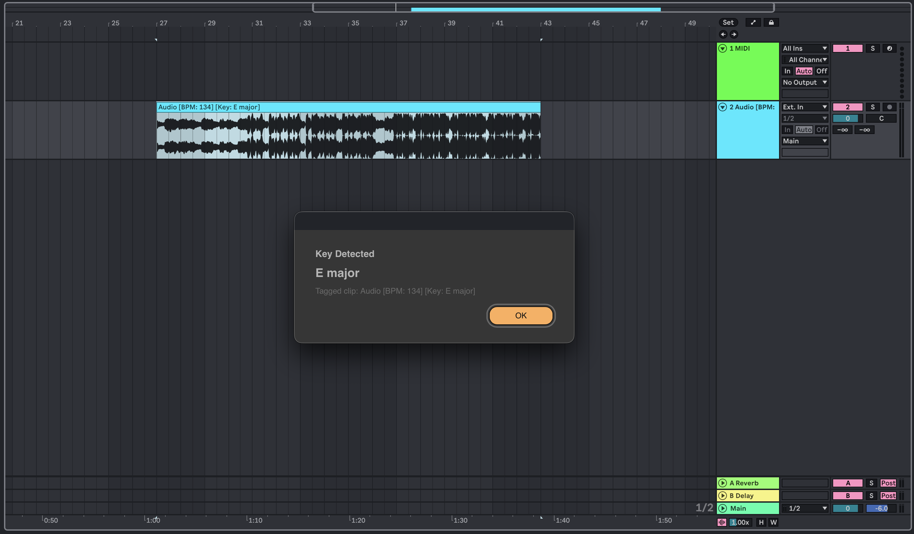

# KeyPulse

KeyPulse is an Ableton Live extension for tagging audio clips with detected key
and BPM.



It adds right-click actions for audio clips:

- **Detect Key**
- **Detect BPM**

Results are appended to the clip name, for example:

```text
Audio [Key: G major] [BPM: 98]
```

## Package

Download or install:

```text
KeyPulse-0.1.0.ablx
```

## Installing

Install `KeyPulse-0.1.0.ablx` through Ableton Live's Extensions workflow.

If the actions do not appear immediately, restart Live or reload the Extension
Host.

## Using KeyPulse

1. Open an Ableton Live set.
2. Right-click an audio clip.
3. Choose **Detect Key** or **Detect BPM**.
4. Wait for the progress dialog to finish.
5. Confirm the result dialog.

KeyPulse updates the clip name with `[Key: ...]` and/or `[BPM: ...]` tags.
Running it again replaces existing KeyPulse tags rather than adding duplicates.

## BPM Detection

KeyPulse analyses the rendered clip audio. The BPM
estimator is designed for arbitrary Ableton audio clips, including loops, stems,
partial regions, and full songs.

It does not trim or remove gaps from the rendered clip.

## Accuracy Notes

Audio analysis is best-effort. KeyPulse can be wrong or uncertain on:

- one-shots
- clips with no clear rhythmic onsets
- tempo-changing songs
- sparse intros or breakdowns
- heavily warped clips
- material where half-time and double-time are both musically plausible

For warped clips, KeyPulse analyses the rendered audio it receives from Live, so
the detected BPM may reflect the rendered/played result rather than the source
file's original native tempo.

## Privacy

KeyPulse runs analysis locally in the extension runtime. It does not require a
cloud service for key or BPM detection.
