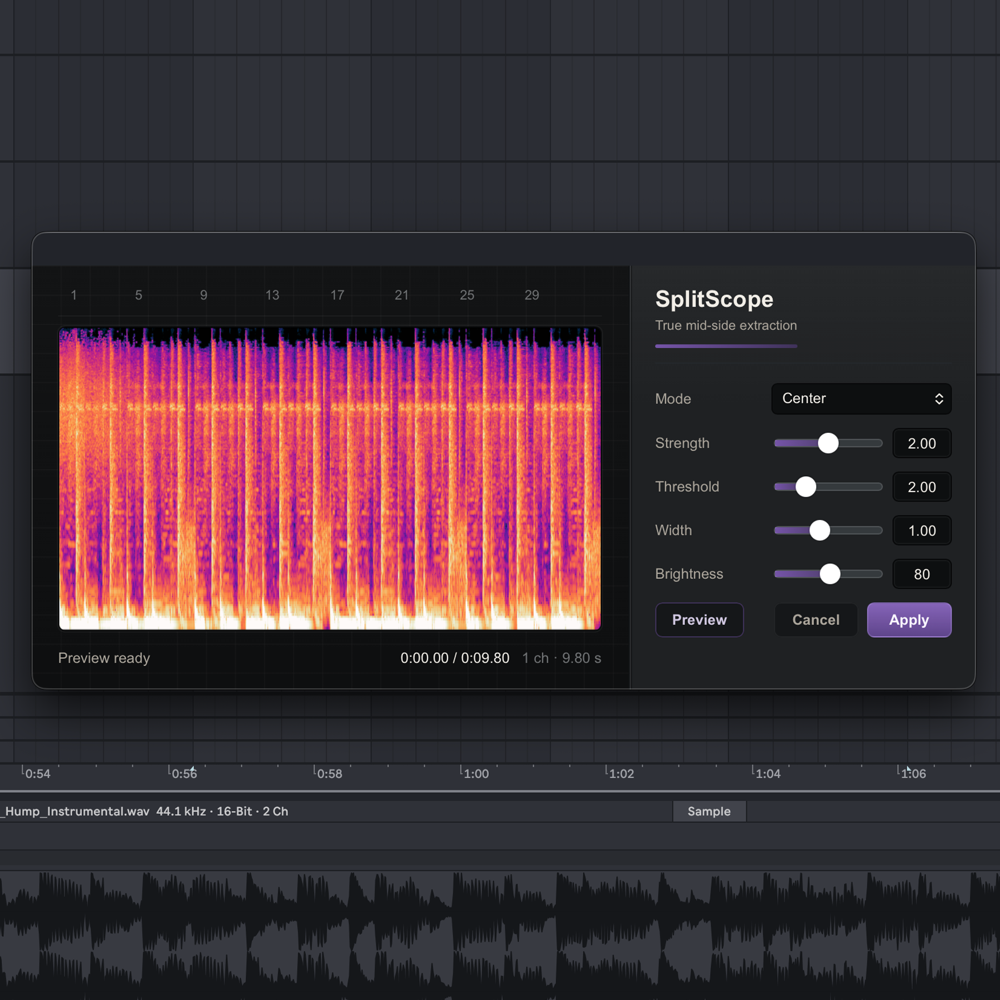

# SplitScope

SplitScope is an Ableton Live extension for true mid-side extraction with a
live spectrogram editor.

It adds a right-click action for audio clips:

- **Open SplitScope...**

The editor previews the extracted audio, shows the processed spectrogram, and
can write the extracted result back into the Live project.

## Package

Current release: **v0.1.1**

Download or install
[SplitScope-0.1.1.ablx](https://github.com/dancarasco/ableton-extensions/releases/download/SplitScope-0.1.1/SplitScope-0.1.1.ablx).

## Installing

Install the `.ablx` archive through Ableton Live's Extensions workflow.

If the action does not appear immediately, restart Live or reload the Extension
Host.

## Using SplitScope

1. Open an Ableton Live set.
2. Right-click an audio clip.
3. Choose **Open SplitScope...**.
4. Adjust the extraction controls while watching the spectrogram preview.
5. Use **Preview** to loop the processed audio.
6. Click **Apply** to import the extracted result into the Live project.

## Controls

- **Mode** chooses Center, Sides, Left, Right, or Mixed extraction.
- **Strength** controls extraction intensity.
- **Threshold** controls the gating behaviour.
- **Width** adjusts stereo width before extraction.
- **Brightness** adjusts the spectrogram display only.

## Privacy

SplitScope runs extraction and spectrogram generation locally in the extension
runtime. It does not require a cloud service.
